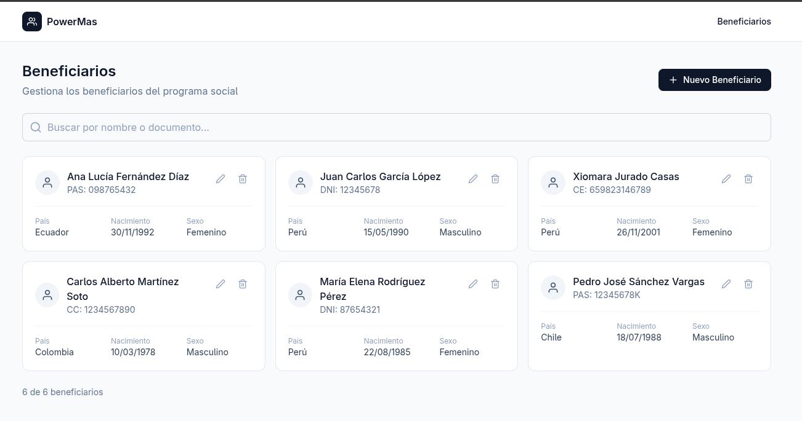
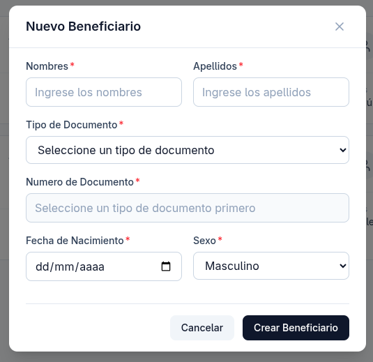
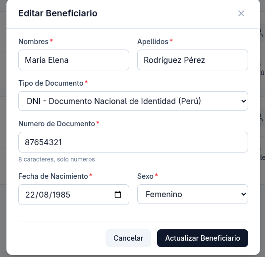

# Sistema de Gestion de Beneficiarios

Sistema web para registrar, consultar, editar y eliminar beneficiarios de un programa social multi-pais.

## Tecnologias

### Backend
- .NET 8 Web API
- Dapper (micro ORM)
- SQL Server 2022
- Stored Procedures

### Frontend
- React 19 + TypeScript
- Vite
- TailwindCSS
- TanStack Query (React Query)
- React Hook Form + Zod
- Axios

### Base de Datos
- SQL Server 2022 (Docker)

## Requisitos Previos

- Docker y Docker Compose
- .NET 8 SDK
- Node.js 18+
- npm o yarn

## Estructura del Proyecto

```
challenge-powermas/
├── backend/           # API .NET 8
├── frontend/          # React + TypeScript
├── database/          # Scripts SQL
│   ├── schema.sql     # Estructura de tablas
│   ├── seed.sql       # Datos iniciales
│   └── procedures.sql # Stored Procedures
└── docker-compose.yml # SQL Server
```

## Capturas de Pantalla

### Página Principal


### Formulario Nuevo Beneficiario


### Formulario Editar Beneficiario


### Video Demostrativo
<video src="assets/example-video.mp4" controls width="100%"></video>

## Instalacion y Ejecucion Local

### 1. Clonar el repositorio

```bash
git clone <url-del-repositorio>
cd challenge-powermas
```

### 2. Iniciar SQL Server con Docker

```bash
docker compose up -d
```

### 3. Configurar la base de datos

**Linux/Mac:**
```bash
chmod +x ./scripts/setup-db.sh
./scripts/setup-db.sh
```

**Windows (PowerShell):**
```powershell
.\scripts\setup-db.ps1
```

### 4. Iniciar el Backend

```bash
cd backend
dotnet restore
dotnet run
```

El API estara disponible en: http://localhost:5000

Para verificar que funciona:
```bash
curl http://localhost:5000/health
curl http://localhost:5000/api/documentos
```

### 5. Iniciar el Frontend

En otra terminal:

```bash
cd frontend
npm install
npm run dev
```

La aplicacion estara disponible en: http://localhost:5173

## Endpoints de la API

### Documentos de Identidad
- `GET /api/documentos` - Lista documentos activos

### Beneficiarios
- `GET /api/beneficiarios` - Lista todos los beneficiarios
- `GET /api/beneficiarios/{id}` - Obtiene un beneficiario por ID
- `POST /api/beneficiarios` - Crea un nuevo beneficiario
- `PUT /api/beneficiarios/{id}` - Actualiza un beneficiario
- `DELETE /api/beneficiarios/{id}` - Elimina un beneficiario

## Funcionalidades Implementadas

1. CRUD completo de beneficiarios
2. Validacion dinamica de documentos:
   - Longitud segun tipo de documento
   - Solo numeros o alfanumerico segun configuracion
   - Feedback visual al usuario
3. Listado de documentos de identidad multi-pais
4. Filtro de busqueda por nombre o documento
5. Interfaz responsiva

## Validacion de Documentos

El sistema valida el numero de documento segun el tipo seleccionado:

| Pais     | Documento | Longitud | Formato      |
|----------|-----------|----------|--------------|
| Peru     | DNI       | 8        | Solo numeros |
| Peru     | CE        | 12       | Alfanumerico |
| Colombia | CC        | 10       | Solo numeros |
| Colombia | TI        | 11       | Solo numeros |
| Ecuador  | CI        | 10       | Solo numeros |
| Chile    | RUN       | 9        | Alfanumerico |
| Mexico   | CURP      | 18       | Alfanumerico |
| Mexico   | INE       | 13       | Solo numeros |

## Configuracion de Base de Datos

Las credenciales por defecto son:
- Server: localhost,1433
- Usuario: sa
- Password: PowerMas2026!
- Base de datos: PowerMasDB

Para modificar la conexion, editar `backend/appsettings.json`.

## Scripts Disponibles

### Frontend
```bash
npm run dev      # Servidor de desarrollo
npm run build    # Build de produccion
npm run preview  # Preview del build
npm run lint     # Linting
```

### Backend
```bash
dotnet run       # Ejecutar en desarrollo
dotnet build     # Compilar
dotnet publish   # Publicar para produccion
```
